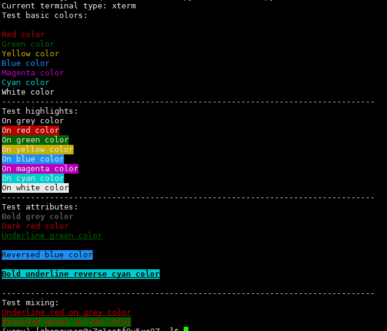

# 作业 
> 用户注册、登录系统

- [x] 用户管理
    - [x] 添加
    - [x] 显示   
    - [ ] 搜索    
    - [ ] 删除 
    - [ ] 修改

## 注意
1. lesson4的代码回顾一遍；
2. lesson4的函数 和  代码回顾一遍；
3. 完善lesson5用户系统的 功能页面.

## 课下娱乐


```python
# coding: utf-8

"""ANSII Color formatting for output in terminal."""

from __future__ import print_function
import os


__ALL__ = [ 'colored', 'cprint' ]

VERSION = (1, 1, 0)

ATTRIBUTES = dict(
        list(zip([
            'bold',
            'dark',
            '',
            'underline',
            'blink',
            '',
            'reverse',
            'concealed'
            ],
            list(range(1, 9))
            ))
        )
del ATTRIBUTES['']


HIGHLIGHTS = dict(
        list(zip([
            'on_grey',
            'on_red',
            'on_green',
            'on_yellow',
            'on_blue',
            'on_magenta',
            'on_cyan',
            'on_white'
            ],
            list(range(40, 48))
            ))
        )


COLORS = dict(
        list(zip([
            'grey',
            'red',
            'green',
            'yellow',
            'blue',
            'magenta',
            'cyan',
            'white',
            ],
            list(range(30, 38))
            ))
        )


RESET = '\033[0m'


def colored(text, color=None, on_color=None, attrs=None):
    """Colorize text.

    Available text colors:
        red, green, yellow, blue, magenta, cyan, white.

    Available text highlights:
        on_red, on_green, on_yellow, on_blue, on_magenta, on_cyan, on_white.

    Available attributes:
        bold, dark, underline, blink, reverse, concealed.

    Example:
        colored('Hello, World!', 'red', 'on_grey', ['blue', 'blink'])
        colored('Hello, World!', 'green')
    """
    if os.getenv('ANSI_COLORS_DISABLED') is None:
        fmt_str = '\033[%dm%s'
        if color is not None:
            text = fmt_str % (COLORS[color], text)

        if on_color is not None:
            text = fmt_str % (HIGHLIGHTS[on_color], text)

        if attrs is not None:
            for attr in attrs:
                text = fmt_str % (ATTRIBUTES[attr], text)

        text += RESET
    return text


def cprint(text, color=None, on_color=None, attrs=None, **kwargs):
    """Print colorize text.

    It accepts arguments of print function.
    """

    print((colored(text, color, on_color, attrs)), **kwargs)


if __name__ == '__main__':
    print('Current terminal type: %s' % os.getenv('TERM'))
    print('Test basic colors:')
    cprint('Grey color', 'grey')
    cprint('Red color', 'red')
    cprint('Green color', 'green')
    cprint('Yellow color', 'yellow')
    cprint('Blue color', 'blue')
    cprint('Magenta color', 'magenta')
    cprint('Cyan color', 'cyan')
    cprint('White color', 'white')
    print(('-' * 78))

    print('Test highlights:')
    cprint('On grey color', on_color='on_grey')
    cprint('On red color', on_color='on_red')
    cprint('On green color', on_color='on_green')
    cprint('On yellow color', on_color='on_yellow')
    cprint('On blue color', on_color='on_blue')
    cprint('On magenta color', on_color='on_magenta')
    cprint('On cyan color', on_color='on_cyan')
    cprint('On white color', color='grey', on_color='on_white')
    print('-' * 78)

    print('Test attributes:')
    cprint('Bold grey color', 'grey', attrs=['bold'])
    cprint('Dark red color', 'red', attrs=['dark'])
    cprint('Underline green color', 'green', attrs=['underline'])
    cprint('Blink yellow color', 'yellow', attrs=['blink'])
    cprint('Reversed blue color', 'blue', attrs=['reverse'])
    cprint('Concealed Magenta color', 'magenta', attrs=['concealed'])
    cprint('Bold underline reverse cyan color', 'cyan',
            attrs=['bold', 'underline', 'reverse'])
    cprint('Dark blink concealed white color', 'white',
            attrs=['dark', 'blink', 'concealed'])
    print(('-' * 78))

    print('Test mixing:')
    cprint('Underline red on grey color', 'red', 'on_grey',
            ['underline'])
    cprint('Reversed green on red color', 'green', 'on_red', ['reverse'])
```


